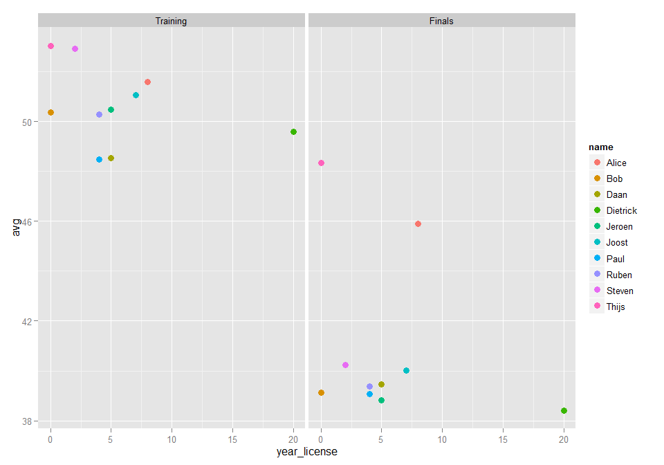
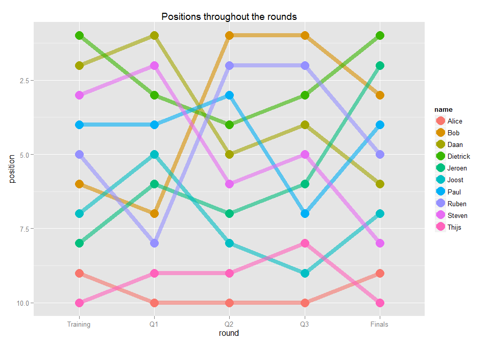

# DZWS_karting
rnvdv  
Monday, May 04, 2015  


```
## Version:  1.34
## Date:     2014-10-31
## Author:   Philip Leifeld (University of Konstanz)
## 
## Please cite the JSS article in your publications -- see citation("texreg").
```


# So we went karting....

'T was one of Daan's last days as a bachelor, and he decided he had little to lose: Let's go karting!

We did a tournament, which included:

1. Training (5 min)
2. Three qualification rounds
+ 10 Rounds each
+ Shifting starting positions
3. A final
+ 15 rounds
+ starting position based on qualification outcomes

Now, this here document will be a quick analysis of what happened. 


## Let's start with the end: the winners


We'll get it over with: Daan didn't quite win (and neither did I). So who did? Early on, people started wondering whether driving experience was the reason some were doing better than others. Here's a nice scatterplot, which does not seem to show any relation between the time someone has a license versus their average laptimes at the start. 


<table>
 <thead>
  <tr>
   <th style="text-align:right;"> pos </th>
   <th style="text-align:left;"> name </th>
   <th style="text-align:right;"> avg </th>
  </tr>
 </thead>
<tbody>
  <tr>
   <td style="text-align:right;"> 1 </td>
   <td style="text-align:left;"> Dietrick </td>
   <td style="text-align:right;"> 38.42 </td>
  </tr>
  <tr>
   <td style="text-align:right;"> 2 </td>
   <td style="text-align:left;"> Jeroen </td>
   <td style="text-align:right;"> 38.82 </td>
  </tr>
  <tr>
   <td style="text-align:right;"> 3 </td>
   <td style="text-align:left;"> Bob </td>
   <td style="text-align:right;"> 39.13 </td>
  </tr>
  <tr>
   <td style="text-align:right;"> 4 </td>
   <td style="text-align:left;"> Paul </td>
   <td style="text-align:right;"> 39.08 </td>
  </tr>
  <tr>
   <td style="text-align:right;"> 5 </td>
   <td style="text-align:left;"> Ruben </td>
   <td style="text-align:right;"> 39.37 </td>
  </tr>
  <tr>
   <td style="text-align:right;"> 6 </td>
   <td style="text-align:left;"> Daan </td>
   <td style="text-align:right;"> 39.47 </td>
  </tr>
  <tr>
   <td style="text-align:right;"> 7 </td>
   <td style="text-align:left;"> Joost </td>
   <td style="text-align:right;"> 40.01 </td>
  </tr>
  <tr>
   <td style="text-align:right;"> 8 </td>
   <td style="text-align:left;"> Steven </td>
   <td style="text-align:right;"> 40.23 </td>
  </tr>
  <tr>
   <td style="text-align:right;"> 9 </td>
   <td style="text-align:left;"> Alice </td>
   <td style="text-align:right;"> 45.89 </td>
  </tr>
  <tr>
   <td style="text-align:right;"> 10 </td>
   <td style="text-align:left;"> Thijs </td>
   <td style="text-align:right;"> 48.33 </td>
  </tr>
</tbody>
</table>

 


That is a nice little show of the endgame, but what got us there? Is it just the 0.479 correlation between our training positions and end positions?


# What happened...


The correlation between the starting rankings and final rankings makes me wonder whether driving experience perhaps impacts the training round. We can simply ogle a plot comparing the time since obtaining a drivers license (a rough proxy of driving experience) and the average laptime in the training and finals part of the tournament. 


 


Still, that doesn't seem to help much. Neither the training nor the finals' outcomes indicate any form a linear relation. But this should not lead you to think our karting was anything but competative. Let's have a look at the positions throughout the rounds. 


 


As you can see, there is quite some jumping around in positions between each of the rounds. In part, you can see how the different starting positions in the qualification rounds impact the position of each driver. Also, note that Dietrick saves his talents after the Training so he can go all-out in the finals!


## Personal improvement


But perhaps the amount of personal improvement is what really benefits from driving experience. If we look at it from the perspective of personal improvement, what does that give us?


### plotting improvement


```
## Warning in reshapeWide(data, idvar = idvar, timevar = timevar, varying =
## varying, : multiple rows match for df_num=Training: first taken
```

  <table>
<caption>Time improvement between training and round 10 averages</caption>
 <thead>
  <tr>
   <th style="text-align:left;">   </th>
   <th style="text-align:left;"> name </th>
   <th style="text-align:right;"> improvement </th>
   <th style="text-align:right;"> avg.Training </th>
   <th style="text-align:right;"> avg.Finals </th>
   <th style="text-align:right;"> pos.Training </th>
   <th style="text-align:right;"> pos.Finals </th>
  </tr>
 </thead>
<tbody>
  <tr>
   <td style="text-align:left;"> 49 </td>
   <td style="text-align:left;"> Steven </td>
   <td style="text-align:right;"> 12.69 </td>
   <td style="text-align:right;"> 52.92 </td>
   <td style="text-align:right;"> 40.23 </td>
   <td style="text-align:right;"> 3 </td>
   <td style="text-align:right;"> 8 </td>
  </tr>
  <tr>
   <td style="text-align:left;"> 25 </td>
   <td style="text-align:left;"> Jeroen </td>
   <td style="text-align:right;"> 11.65 </td>
   <td style="text-align:right;"> 50.47 </td>
   <td style="text-align:right;"> 38.82 </td>
   <td style="text-align:right;"> 8 </td>
   <td style="text-align:right;"> 2 </td>
  </tr>
  <tr>
   <td style="text-align:left;"> 7 </td>
   <td style="text-align:left;"> Bob </td>
   <td style="text-align:right;"> 11.23 </td>
   <td style="text-align:right;"> 50.36 </td>
   <td style="text-align:right;"> 39.13 </td>
   <td style="text-align:right;"> 6 </td>
   <td style="text-align:right;"> 3 </td>
  </tr>
  <tr>
   <td style="text-align:left;"> 19 </td>
   <td style="text-align:left;"> Dietrick </td>
   <td style="text-align:right;"> 11.16 </td>
   <td style="text-align:right;"> 49.58 </td>
   <td style="text-align:right;"> 38.42 </td>
   <td style="text-align:right;"> 1 </td>
   <td style="text-align:right;"> 1 </td>
  </tr>
  <tr>
   <td style="text-align:left;"> 31 </td>
   <td style="text-align:left;"> Joost </td>
   <td style="text-align:right;"> 11.06 </td>
   <td style="text-align:right;"> 51.07 </td>
   <td style="text-align:right;"> 40.01 </td>
   <td style="text-align:right;"> 7 </td>
   <td style="text-align:right;"> 7 </td>
  </tr>
  <tr>
   <td style="text-align:left;"> 43 </td>
   <td style="text-align:left;"> Ruben </td>
   <td style="text-align:right;"> 10.90 </td>
   <td style="text-align:right;"> 50.27 </td>
   <td style="text-align:right;"> 39.37 </td>
   <td style="text-align:right;"> 5 </td>
   <td style="text-align:right;"> 5 </td>
  </tr>
  <tr>
   <td style="text-align:left;"> 37 </td>
   <td style="text-align:left;"> Paul </td>
   <td style="text-align:right;"> 9.40 </td>
   <td style="text-align:right;"> 48.48 </td>
   <td style="text-align:right;"> 39.08 </td>
   <td style="text-align:right;"> 4 </td>
   <td style="text-align:right;"> 4 </td>
  </tr>
  <tr>
   <td style="text-align:left;"> 13 </td>
   <td style="text-align:left;"> Daan </td>
   <td style="text-align:right;"> 9.06 </td>
   <td style="text-align:right;"> 48.53 </td>
   <td style="text-align:right;"> 39.47 </td>
   <td style="text-align:right;"> 2 </td>
   <td style="text-align:right;"> 6 </td>
  </tr>
  <tr>
   <td style="text-align:left;"> 1 </td>
   <td style="text-align:left;"> Alice </td>
   <td style="text-align:right;"> 5.71 </td>
   <td style="text-align:right;"> 51.60 </td>
   <td style="text-align:right;"> 45.89 </td>
   <td style="text-align:right;"> 9 </td>
   <td style="text-align:right;"> 9 </td>
  </tr>
  <tr>
   <td style="text-align:left;"> 55 </td>
   <td style="text-align:left;"> Thijs </td>
   <td style="text-align:right;"> 4.71 </td>
   <td style="text-align:right;"> 53.04 </td>
   <td style="text-align:right;"> 48.33 </td>
   <td style="text-align:right;"> 10 </td>
   <td style="text-align:right;"> 10 </td>
  </tr>
</tbody>
</table>


So did the best learner win? It's not quite clear from that little diddy. So we'll throw it through a simple lm, just for the heck of it. But wait, how do the extra rounds figure into this (if your quick, you can do more rounds...)


### Running some statistics


Because we could see how the starting positions improve the outcomes, we need to control for it. But in addition, we have three potential determinants of success:

1. The number of rounds people had to practice
2. Whether you have a license or not
3. How long you've had this license


We'll run some models to compare, so we can see which provides the best explanation. 


```
## 
## ===================================================
##               Model 1   Model 2    Model 3  Model 4
## ---------------------------------------------------
## (Intercept)   -30.31     50.79     -19.47   -28.10 
##               (28.74)   (22.65)    (32.06)  (32.81)
## avg.Training    1.41 *    0.44       1.22     1.37 
##                (0.57)    (0.36)     (0.62)   (0.64)
## rounds                   -0.67 **                  
##                          (0.14)                    
## license                             -1.94          
##                                     (2.32)         
## year_license                                 -0.03 
##                                              (0.18)
## ---------------------------------------------------
## R^2             0.43      0.87       0.49     0.44 
## Adj. R^2        0.36      0.83       0.34     0.28 
## Num. obs.      10        10         10       10    
## ===================================================
## *** p < 0.001, ** p < 0.01, * p < 0.05
```


Surprisingly, when we test for the number of rounds, it doesn't really matter how fast you were at the start. The take away message? Practice makes perfect. Or perhaps: we actually needed more time to improve... (And let's be honest, the number of rounds is strongly related to your speed).


# The End (?)


That's it: the better your start, the more rounds you do, the better you end! 
Now there's a first-mover advantage for you!
