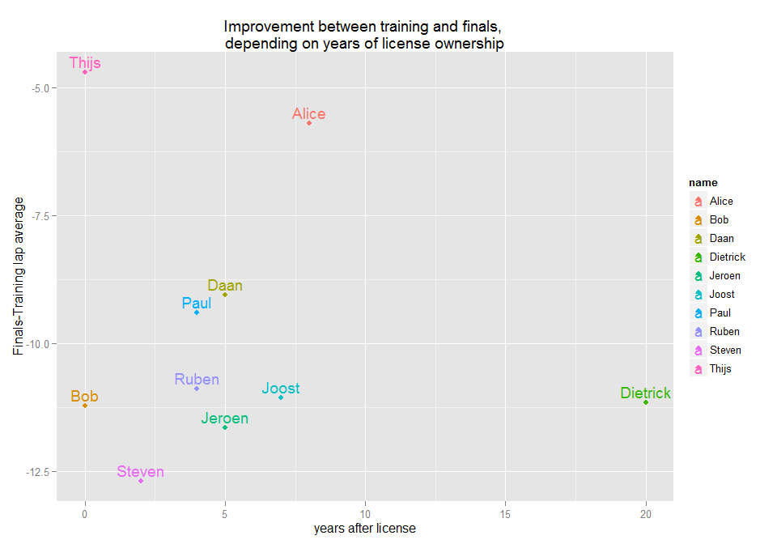

# DZWS_karting
rnvdv  
Monday, May 04, 2015  


```
## Version:  1.34
## Date:     2014-10-31
## Author:   Philip Leifeld (University of Konstanz)
## 
## Please cite the JSS article in your publications -- see citation("texreg").
```


# So we went karting....

'T was one of Daan's last days as a bachelor, and he decided he had little to lose: Let's go karting!

But who won, and why? Let's use this as a quick-'n-dirty presentation of R-markdown, the wonderous world of linear modelling and how people learn how to go-karting!

## Let's start with the end: the winners

We'll get it over with: Daan didn't quite win (and neither did I). So who did?


```r
kable(finals[c("pos","name","avg")], format="pandoc")
```


 pos  name          avg
----  ---------  ------
   1  Dietrick    38.42
   2  Jeroen      38.82
   3  Bob         39.13
   4  Paul        39.08
   5  Ruben       39.37
   6  Daan        39.47
   7  Joost       40.01
   8  Steven      40.23
   9  Alice       45.89
  10  Thijs       48.33

```r
finals$name <- factor(finals$name,levels=(finals$name[order(finals$pos)]),ordered = T,)
ggplot(finals,aes(x=name,y=avg))+stat_identity(geom="bar")
```

 

That is a nice little show of the endgame, but what got us there? It's not the 0.479 correlation between our training positions and end positions. So what happened?

# What happened

If we look at the positions starting from our training rounds and leading up to the finals, we get quite a competitive field. Especially between the third qualification and the Finals, things seem to be changing rapidly. 

 

## Personal improvement

If we look at it from the perspective of personal improvement, what does that give us?


```r
ggplot(kartdata,aes(x=df_num,y=avg, colour=name))+
  geom_line(aes(group=name),size=3)+
  geom_point(line="white",size=6)+
  scale_y_reverse()+xlab("round")+ ylab("inverted time")+ggtitle("Personal round averages throughout the rounds")
```

 

```r
wide_kart <- reshape(data = kartdata,direction="wide", timevar="df_num",idvar="name")
```

```
## Warning in reshapeWide(data, idvar = idvar, timevar = timevar, varying =
## varying, : multiple rows match for df_num=Training: first taken
```

```r
wide_kart$improvement <- wide_kart$avg.Training - wide_kart$avg.Finals

kable(wide_kart[order(wide_kart$improvement,decreasing=T),c("name","improvement","avg.Training" ,"avg.Finals","pos.Training","pos.Finals")],caption = "Time improvement between training and round 10 averages")
```

<table>
<caption>Time improvement between training and round 10 averages</caption>
 <thead>
  <tr>
   <th style="text-align:left;">   </th>
   <th style="text-align:left;"> name </th>
   <th style="text-align:right;"> improvement </th>
   <th style="text-align:right;"> avg.Training </th>
   <th style="text-align:right;"> avg.Finals </th>
   <th style="text-align:right;"> pos.Training </th>
   <th style="text-align:right;"> pos.Finals </th>
  </tr>
 </thead>
<tbody>
  <tr>
   <td style="text-align:left;"> 3 </td>
   <td style="text-align:left;"> Steven </td>
   <td style="text-align:right;"> 12.69 </td>
   <td style="text-align:right;"> 52.92 </td>
   <td style="text-align:right;"> 40.23 </td>
   <td style="text-align:right;"> 3 </td>
   <td style="text-align:right;"> 8 </td>
  </tr>
  <tr>
   <td style="text-align:left;"> 8 </td>
   <td style="text-align:left;"> Jeroen </td>
   <td style="text-align:right;"> 11.65 </td>
   <td style="text-align:right;"> 50.47 </td>
   <td style="text-align:right;"> 38.82 </td>
   <td style="text-align:right;"> 8 </td>
   <td style="text-align:right;"> 2 </td>
  </tr>
  <tr>
   <td style="text-align:left;"> 6 </td>
   <td style="text-align:left;"> Bob </td>
   <td style="text-align:right;"> 11.23 </td>
   <td style="text-align:right;"> 50.36 </td>
   <td style="text-align:right;"> 39.13 </td>
   <td style="text-align:right;"> 6 </td>
   <td style="text-align:right;"> 3 </td>
  </tr>
  <tr>
   <td style="text-align:left;"> 1 </td>
   <td style="text-align:left;"> Dietrick </td>
   <td style="text-align:right;"> 11.16 </td>
   <td style="text-align:right;"> 49.58 </td>
   <td style="text-align:right;"> 38.42 </td>
   <td style="text-align:right;"> 1 </td>
   <td style="text-align:right;"> 1 </td>
  </tr>
  <tr>
   <td style="text-align:left;"> 7 </td>
   <td style="text-align:left;"> Joost </td>
   <td style="text-align:right;"> 11.06 </td>
   <td style="text-align:right;"> 51.07 </td>
   <td style="text-align:right;"> 40.01 </td>
   <td style="text-align:right;"> 7 </td>
   <td style="text-align:right;"> 7 </td>
  </tr>
  <tr>
   <td style="text-align:left;"> 5 </td>
   <td style="text-align:left;"> Ruben </td>
   <td style="text-align:right;"> 10.90 </td>
   <td style="text-align:right;"> 50.27 </td>
   <td style="text-align:right;"> 39.37 </td>
   <td style="text-align:right;"> 5 </td>
   <td style="text-align:right;"> 5 </td>
  </tr>
  <tr>
   <td style="text-align:left;"> 4 </td>
   <td style="text-align:left;"> Paul </td>
   <td style="text-align:right;"> 9.40 </td>
   <td style="text-align:right;"> 48.48 </td>
   <td style="text-align:right;"> 39.08 </td>
   <td style="text-align:right;"> 4 </td>
   <td style="text-align:right;"> 4 </td>
  </tr>
  <tr>
   <td style="text-align:left;"> 2 </td>
   <td style="text-align:left;"> Daan </td>
   <td style="text-align:right;"> 9.06 </td>
   <td style="text-align:right;"> 48.53 </td>
   <td style="text-align:right;"> 39.47 </td>
   <td style="text-align:right;"> 2 </td>
   <td style="text-align:right;"> 6 </td>
  </tr>
  <tr>
   <td style="text-align:left;"> 9 </td>
   <td style="text-align:left;"> Alice </td>
   <td style="text-align:right;"> 5.71 </td>
   <td style="text-align:right;"> 51.60 </td>
   <td style="text-align:right;"> 45.89 </td>
   <td style="text-align:right;"> 9 </td>
   <td style="text-align:right;"> 9 </td>
  </tr>
  <tr>
   <td style="text-align:left;"> 10 </td>
   <td style="text-align:left;"> Thijs </td>
   <td style="text-align:right;"> 4.71 </td>
   <td style="text-align:right;"> 53.04 </td>
   <td style="text-align:right;"> 48.33 </td>
   <td style="text-align:right;"> 10 </td>
   <td style="text-align:right;"> 10 </td>
  </tr>
</tbody>
</table>

So did the best learner win? It's not quite clear from that little diddy. So we'll throw it through a simple lm, just for the heck of it. But wait, how do the extra rounds figure into this (if your quick, you can do more rounds...)


```r
roundnames <- character()
for(n in paste(".",unique(kartdata$df_num),sep="")) for (ni in paste("X",1:15,n,sep="")) if (ni %in% names(wide_kart)) roundnames <- c(roundnames,ni)
wide_kart$rounds <- apply(wide_kart[roundnames],1,function(x){sum(!is.na(x))})

m <- lm(avg.Finals~avg.Training*rounds,wide_kart)
summary(m)
```

```
## 
## Call:
## lm(formula = avg.Finals ~ avg.Training * rounds, data = wide_kart)
## 
## Residuals:
##      Min       1Q   Median       3Q      Max 
## -0.56087 -0.12315  0.06638  0.23176  0.38687 
## 
## Coefficients:
##                       Estimate Std. Error t value Pr(>|t|)    
## (Intercept)         -857.78589  109.01823  -7.868 0.000223 ***
## avg.Training          17.93570    2.09836   8.547 0.000141 ***
## rounds                17.67934    2.19749   8.045 0.000197 ***
## avg.Training:rounds   -0.35355    0.04234  -8.351 0.000160 ***
## ---
## Signif. codes:  0 '***' 0.001 '**' 0.01 '*' 0.05 '.' 0.1 ' ' 1
## 
## Residual standard error: 0.4254 on 6 degrees of freedom
## Multiple R-squared:  0.9894,	Adjusted R-squared:  0.9841 
## F-statistic: 187.1 on 3 and 6 DF,  p-value: 2.578e-06
```

```r
plotreg(m)
```

```
## Model 1: bars denote 0.5 (inner) resp. 0.95 (outer) confidence intervals (computed from standard errors).
```

 

# The End (?)

That's it: the better your start, the more rounds you do, the better you end! 
Now theres a first-mover advantage for you!
